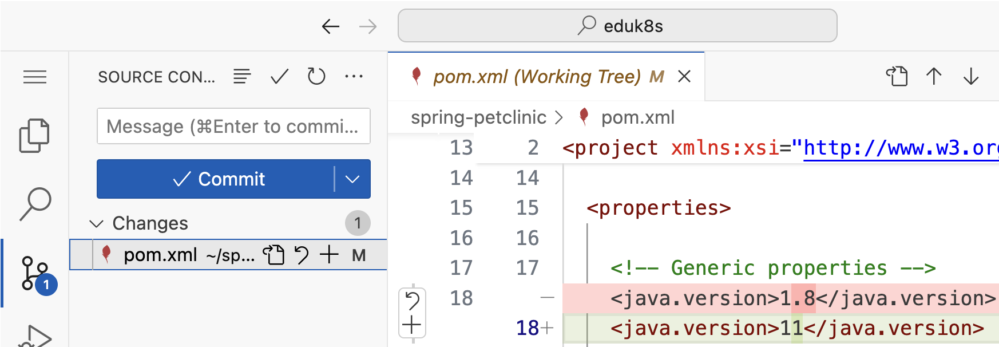
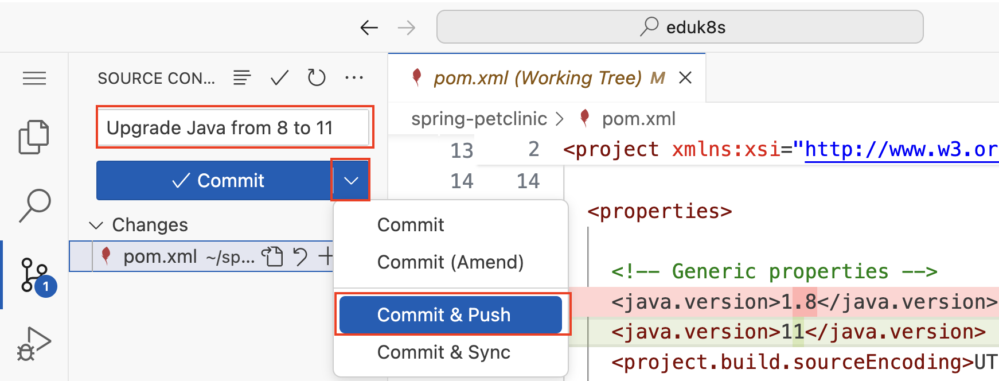

#### Sample Application

To discover the capabilities of *Spring Application Advisor*, we will use a well known application: [Spring Petclinic](https://github.com/spring-projects/spring-petclinic).  
*Spring PetClinic* is a sample application designed to show how the Spring stack can be used to build simple, but powerful database-oriented applications. It demonstrates the use of Spring Boot with Spring MVC and Spring Data JPA.

*Spring PetClinic* is constantly upgraded to the latest versions, so we go back in time and check-out a version from around two years when it was still **based on Spring Boot 2.7 and Java 8**.

```execute
git clone :///spring-petclinic && cd spring-petclinic
```

```editor:open-file
file: ~/spring-petclinic/pom.xml
description: Open Maven POM to see used Spring Boot and Java version
line: 1
```
```editor:select-matching-text
file: ~/spring-petclinic/pom.xml
text: "<version>2.7.3</version>"
```
```editor:select-matching-text
file: ~/spring-petclinic/pom.xml
text: "<java.version>1.8</java.version>"
```

The Spring Boot migration from Spring Boot version 2.7 to 3.x (and Spring Framework 6) is challenging due to baseline changes to **Java 17+**, and **Jakarta EE 9+**.
Without a *VMware Spring Enterprise* subscription, [Spring Boot 2.7 is end of support](https://spring.io/projects/spring-boot#support) since 11/2023, which means that no new security fixes will be released as open-source.

Let's run *Spring PetClinic* to validate that it works before our upgrade.
```terminal:execute
command: cd spring-petclinic && ./mvnw spring-boot:run
session: 2
```

When the application started, click here to open a new browser tab with the running application.
```dashboard:open-url
url: ://petclinic-.
```

Kill the application.
```terminal:interrupt
session: 2
```

#### Running our first upgrade step

*Spring Application Advisor*'s native CLI, that was introduced earlier, is called **advisor**, and available for all common operating systems.

As you can see, it supports the `build-config` and `upgrade-plan` commands.
```execute
advisor --help
```

##### Produce a build configuration
The first step in the upgrade process is to produce a build configuration for *Spring Application Advisor* with the `build-config get` command.
```execute
advisor build-config get --help
```
You may have already seen that our sample application contains configurations and also wrappers for both build tools, Maven and Gradle. With the `--build-tool` option it's possible to select your prefered one for the upgrade. In our case the default `mvnw`(Maven wrapper) is fine, and as we've already changed the directory to the root of our sample application.
We are also happy with the default of the `--path` option and don't have to set it.
```execute
advisor build-config get
```

The produced build configuration contains the dependency tree using the CycloneDX format, the Java version required to compile the sources, and build tool versions.
```editor:open-file
file: ~/spring-petclinic/target/.advisor/build-config.json
```

##### Analyze an upgrade plan

With the information in the generated build configuration, the *Spring Application Advisor* is able to compute the upgrade plan, which we can view with the `advisor upgrade-plan get` command.
```execute
advisor upgrade-plan get
```

##### Apply an upgrade plan from your local machine
Now it's finally time to run our first upgrade step with the `advisor upgrade-plan apply` command. 
As you can see there are a way more options available than for the previous commands.
```execute
advisor upgrade-plan apply --help
```
With the `--after-upgrade-cmd`, you can automatically run a Maven goal or Gradle task after the upgrade, which we will do later as part of this workshop.

As the upgrade process is automated based on `OpenRewrite` using the Maven/Gradle build tools, it runs as a consequence on a JVM. The `--build-tool-options` and `--build-tool-jvm-args` options make it possible to [tweak the build tools and JVM](https://docs.vmware.com/en/Tanzu-Spring-Runtime/Commercial/Tanzu-Spring-Runtime/app-advisor-run-app-advisor-cli.html#increasing-memory-limit) for larger code bases by for example increasing the memory limit or changing the Garbage Collector.

The `--push` option enables the capability to automatically create a remote branch, push the changes, and open a pull request for review by the developer team before changes are merged into the code base.  

Last but not least, there is a `--from-yml` option, that references a `spring-app-advisor.yml` file in the source code repository, which enables (or disables) based on its contents (e.g. `enabled: true`) continuous and incremental upgrades within a CI/CD pipline.

For the sake of simplicity in this workshop, we run the steps to upgrade our code base locally and not in a CI/CD pipeline, and without the `--push` option, as pull requests are not part of Git itself, but available at providers like GitHub, GitLab ,or Bitbucket.

The first step of our upgrade plan is to **upgrade Java from 8 to 11**. Let's run it!
```execute
advisor upgrade-plan apply
```

We can discover the changes made to our code base with the Git CLI.
```execute
git status
git --no-pager diff pom.xml
```

But let's from now on use the related *Source Control view* of the Visual Stuio Code editor in the workshop environment.
```editor:execute-command
command: workbench.view.scm
description: Open the "Source Control" view in editor
```

In the *Source Control view*, click on the files listed under *Changes* (in our case only `pom.xml`) to see the details. 


Let's commit and push the changes before we move on with our upgrade plan.
To do this, enter a commit message like `Upgrade Java from 8 to 11` in the *Message* field, click on the down arror on the right of the commit button and select *Commit & Push*.
